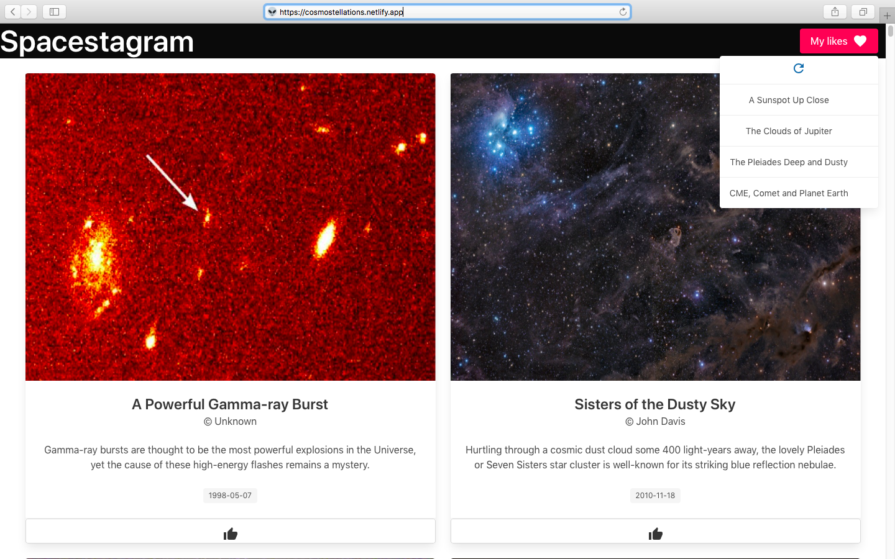

# Spacestagram

A beta for this project is now available [online](https://cosmostellations.netlify.app/)!

## First Look

## Implemented Features

- Saving a user's likes, agnostic of what session they're in.
- Copyright author, date and brief description for images on the website provided.
- Loading state informs users of potent delay.

## Reproducing Locally

- Clone the project repository.
- `cd` into the project directory.

In the project directory, you can run:

### `yarn start` &nbsp; or &nbsp; `npm start`

Runs the app in the development mode.\
Open [http://localhost:3000](http://localhost:3000) to view it in the browser.

The page will reload if you make edits.\
You will also see any lint errors in the console.
